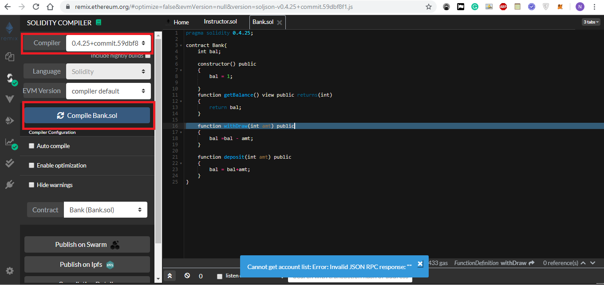
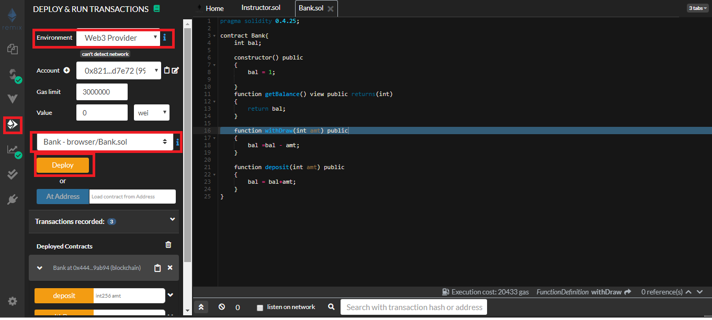

# Introduction
This is a demo app of Bank application using the Blockchain smart contract system.

# How it works?

Go to : https://remix.ethereum.org -> create bank.sol given in the github file copy paste the code. 

Go to compile section select the proper compiler as written in the bank.sol (pragma solidity 0.4.25) 

Click on compile and note down the abi json from the bottom 
Go to Deploy and Run section select enviorment = web3 provider
before this (npm install -g ethereumjs-testrpc)install testrpc
 and run it using testrpc command 
etherium network on local machine.  
select one account and click on deploy Note down the deployed 

 

Replace the values of ABI key and deployed contract address in Index.html and run the index.html using any server whole application will be running.

 
# Demo

# Ref
https://www.youtube.com/watch?v=X06TQOOBrhM
 
https://coursetro.com/posts/code/99/Interacting-with-a-Smart-Contract-through-Web3.js-(Tutorial)
 
#NOTE: I used https://www.youtube.com/watch?v=X06TQOOBrhM with the local hosted rpc enviorment. In real enviorment Address is not visible due to Version conflict.
 
Hope you enjoyed